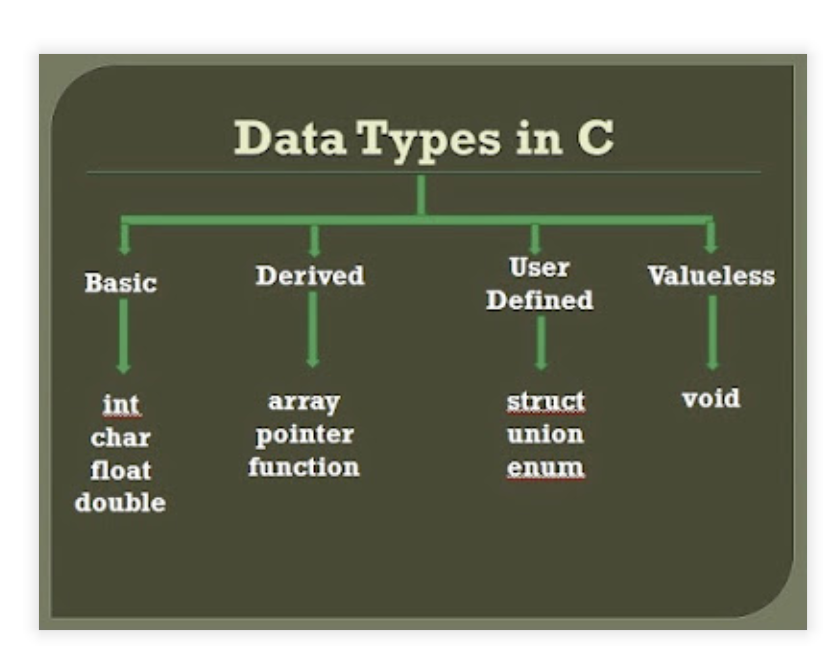

# C Variables
```c

•	When variable is declared a memory allocation is done 
•	It is necessary  for compiler to know the the type of data that the variable will store , hence VARIABLE Is declared with its type
•	Declaration is necessary bcz C Iis statistical language 

Basic Syntax:
type variable_name;

int age;
float salary;
char grade;
double pi = 3.14159;

```

## More clarity on the declarartion

```c
---> int a =1 ;in this both declaration  of variable and intialisation is done 

---> b=1; this will give error called undeclared variable ,because declariang variable means u must specify the data type to it ,in this line only initialisation is done.
how will memory be allocated for above variables

```
## Datat types that can be used to declare the variables 

```c

```

## Memory allocation of variables 
```c
Variable is always defined by its data type  thus size is decided by the type of the variable and the  where to allocate that is which memory region will be decided based on the scope of the variable ,as well as storage class, lets discuss further about the MEMORY REGION , SCOPE AND STORAGE CLASS .
```

## MEMORY REGION 

Stack Memory
Heap Memory (Dynamic Memory)
Data Segment (Global/Static Memory)
Text Segment (Code Segment)

## Stack Memory

Purpose: The stack is used for managing function calls and local variables. It grows and shrinks as functions are called and return.

Characteristics:

Automatic: Variables are automatically allocated and deallocated.
Scope: Local variables and function parameters are stored on the stack.
Lifespan: The lifetime of variables stored on the stack is limited to the duration of the function call.
Size: Limited and usually smaller compared to the heap.
Memory Management: Managed by the system automatically.

## Heap Memory
Purpose: The heap is used for dynamic memory allocation. Memory on the heap is allocated and deallocated explicitly by the programmer using malloc(), calloc(), realloc(), and free().
Characteristics:
Dynamic Allocation: Memory is allocated at runtime.
Manual Management: The programmer must explicitly manage memory (allocate and free).
Scope: Variables stored on the heap are global in terms of accessibility, but they must be explicitly freed when no longer needed.
Size: Larger than the stack, but can run out of space if memory is not properly freed

## Data Segment
Purpose: The data segment is used to store global variables and static variables.

Characteristics:
Global/Static Variables: These are variables that are accessible across functions and have a lifetime that lasts for the duration of the program.
Divided into two parts:
        1.Initialized data segment: Stores variables initialized with a value.
        2.Uninitialized data segment (BSS): Stores global or static variables that are initialized to zero by default.

 ## Memory Layout Overview

|    Stack (grows downwards)  |

|    Heap (grows upwards)     |

|    Uninitialized Data (BSS) |

|    Initialized Data         |


## Standard Data Types and Their Typical Sizes
```c
unsigned char	1	
short	2	
unsigned short	2	
int	4	
unsigned int	4	
long	4 
unsigned long	4 
long long	8	
unsigned long long	8	
float	4	
double	8	
long double	8 (or 16)	
void	N/A (no size, as it's not a variable)	

```


       


